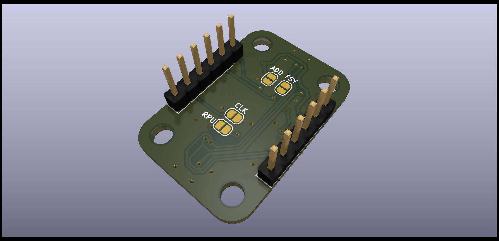
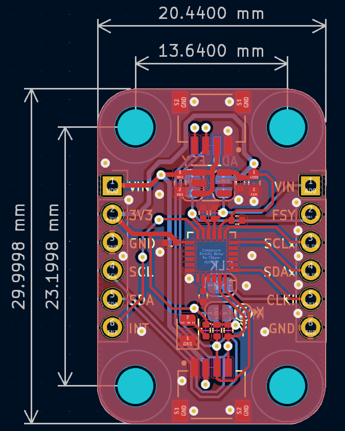

## MPU6050
MPU6050 breakout board module with Stemma QT styles connector. All pinout and I2C connector is similar to Adafruit's MPU6050 breakout board to ensure compatibility. 

### MPU6050 Top

### MPU6050 Bottom

### MPU6050 PCB Dimension
